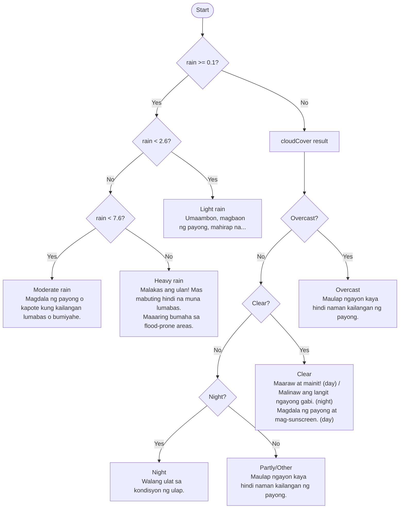

# Hello

```mermaid
flowchart TD
  Start([Start])
  RAIN{rain >= 0.1?}
  LIGHT{rain < 2.6?}
  MODERATE{rain < 7.6?}
  LIGHTRAIN[Light rain
    Umaambon, magbaon ng payong, mahirap na...]
  MODRAIN[Moderate rain
    Magdala ng payong o kapote kung kailangan lumabas o bumiyahe.]
  HEAVYRAIN[Heavy rain
    Malakas ang ulan! Mas mabuting hindi na muna lumabas.
    Maaaring bumaha sa flood-prone areas. ]
  CLOUD[cloudCover result]
  OVERCAST{Overcast?}
  CLEAR{Clear?}
  NIGHT{Night?}
  OVERCASTRES[Overcast
    Maulap ngayon kaya hindi naman kailangan ng payong.]
  CLEARRES["Clear
    Maaraw at mainit! (day) / Malinaw ang langit ngayong gabi. (night)
    Magdala ng payong at mag-sunscreen. (day)"]
  NIGHTRES[Night
    Walang ulat sa kondisyon ng ulap.]
  DEFAULT[Partly/Other
    Maulap ngayon kaya hindi naman kailangan ng payong.]

  Start --> RAIN
  RAIN -- Yes --> LIGHT
  RAIN -- No  --> CLOUD
  LIGHT -- Yes --> LIGHTRAIN
  LIGHT -- No --> MODERATE
  MODERATE -- Yes --> MODRAIN
  MODERATE -- No  --> HEAVYRAIN
  CLOUD --> OVERCAST
  OVERCAST -- Yes --> OVERCASTRES
  OVERCAST -- No --> CLEAR
  CLEAR -- Yes --> CLEARRES
  CLEAR -- No --> NIGHT
  NIGHT -- Yes --> NIGHTRES
  NIGHT -- No --> DEFAULT
```
